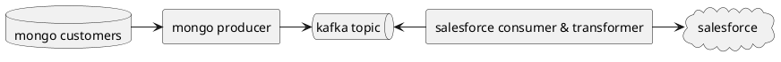

```plantuml:current-component
@startuml
database "mongo customers" as mc
rectangle "mongo producer" as mp
queue "kafka topic" as topic
rectangle "salesforce consumer & transformer" as sc
cloud "salesforce" as sf

mc -right-> mp
mp -right-> topic
sc -left-> topic
sc -right-> sf
@enduml
```
